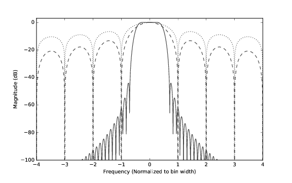
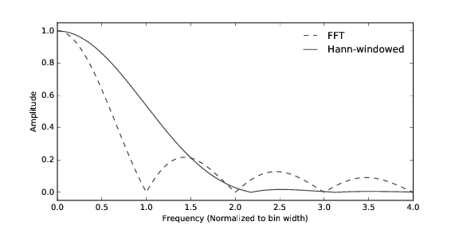
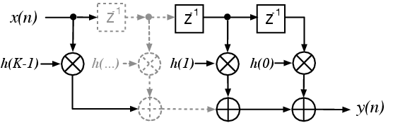
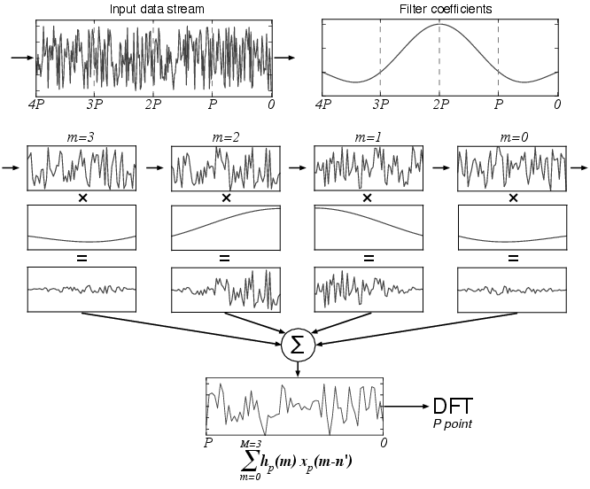

### PFB diagrams

These diagrams are licensed under [CC-BY 4.0](https://creativecommons.org/licenses/by/4.0/).

##### fb_comparison.pdf

Comparison between ACS (dotted), FTF (dashed) and PFB 8-tap Hann windowed PFB filter responses.

##### fft_resp.pdf

Effect of applying a windowing function to an FFT. The main lobe is broadened but the sidelobes are supressed.

##### fir_filter.pdf

Block diagram showing a FIR filter.

##### pfb_chart.pdf

The diagram shows an input signal being divided into $M$ taps, each with $P$ points. Within each tap, the signal is  multiplied by the filter coefficients, then a sum across taps is performed. After this, another $P$ points are read, and the signals propagate left-to-right into the next tap (following the arrows).

##### pfb\_fir\_fft.pdf
